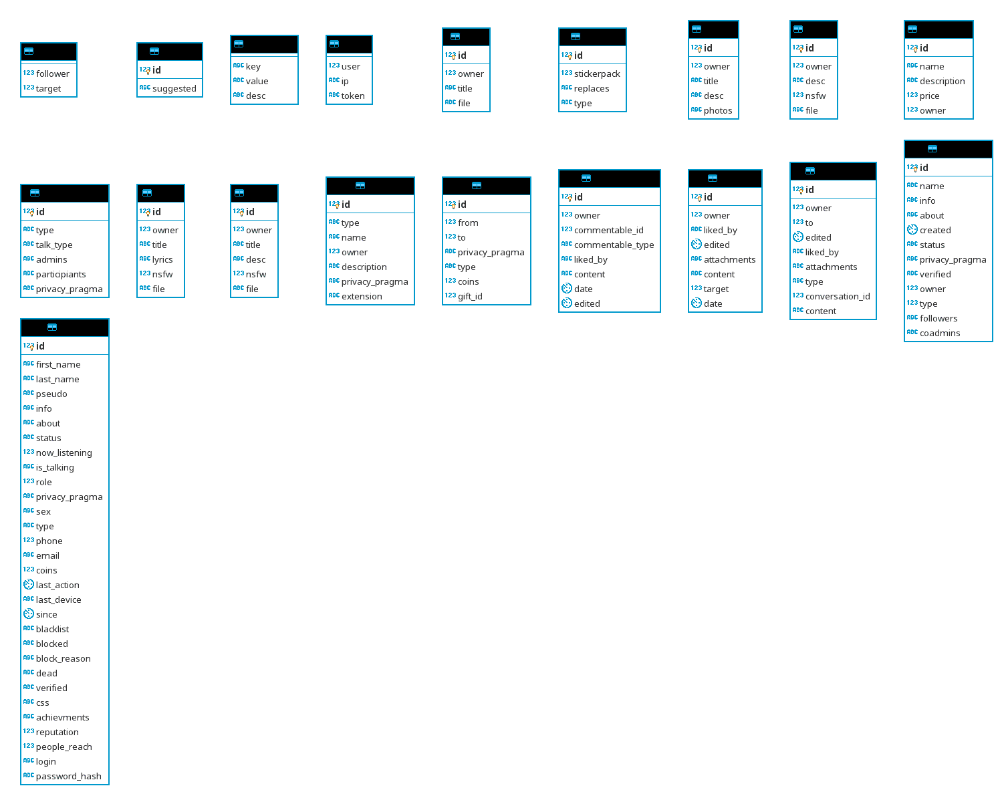

LibreSocial hasn't got an installation script now. So you should do installation by yourself.

# Checking your environment 
Please make sure that your environment meets following system requirements:
|Hardware|Minimal         |Recommended        |
|--------|----------------|-------------------|
|CPU     |1.4GHz          |2.2GHz (64-bit)    |
|RAM     |512MB           |4096MB             |
|Storage |64MB HDD        |1GB PCI SSD        |
|Internet|Optional        |Optional           |

|Software  |Minimal         |Recommended        |
|----------|----------------|-------------------|
|OS        |openSUSE Leap 15|Windows Server 2016|
|Web Server|Apache 2.4      |Apache 2.4         |
|PHP       |7.2.8           |7.2.8              |
|Composer  |Yes             |1.7                |
|Bower     |Yes             |Yes                |
|Kafka     |Optional        |2.0.1              |
|DB        |MySQL 8         |MySQL 8 + Ignite   |
|Caching   |Optional        |Ignite             |

|PHP Module|Minimal         |Recommended        |
|----------|----------------|-------------------|
|Enchant   |Optional        |Yes                |
|Sodium    |Yes             |Yes                |
|Fileinfo  |Yes             |Yes                |
|JSON      |Yes             |Yes                |
|PDO       |Yes             |Yes                |
|PDO MySQL |Yes             |Yes                |
|PDO ODBC  |Optional        |Yes                |
|Gmagick   |Yes             |Yes                |
|pthreads  |Optional        |Yes                |

|Other           |Minimal         |Recommended        |
|----------------|----------------|-------------------|
|RAM per Script  |16MB            |128MB              |
|Superuser access|Yes             |Yes                |
|Shell access    |Yes             |Yes                |
|Git             |Yes             |Yes                |
|SQL Client      |PMA 4.8.3       |Valentina Studio   |

# Creating Database
Create your database in PMA/VS or any other convinient for you SQL-client, then download and execute following file (in DB): [DB Init](https://gist.github.com/kfcjew/c421f80b19d8333738f18622904814a7) \
Verify that you've got following structure: \


## MySQL 8 Warning
MySQL8 introduces new auth algorithm, which is not supported by PDO, thus, you *must* disable it.

## Creating first user
Create your first user, you may use the following cheatsheet:
|Key          |Default value|Recommended value    |Example       |
|-------------|-------------|---------------------|--------------|
|id           |None         |1                    |1             |
|*_name       |Jane Doe     |Your name            |Joseph Joestar|
|pseudo       |None         |Your nickname        |JoJo          |
|info         |None         |Your user description|Hello, ppl    |
|about        |None         |`{}`                 |`{}`          |
|status       |None         |Your status          |Happy         |
|now_listening|None         |`0`                  |`0`           |
|is_talking   |`no`         |Leave default        |`no`          |
|role         |`0`          |Leave default        |`0`           |
|last_action  |Current time |Leave default        |`1544899509`  |
|last_device  |`pc`         |Leave default        |`tv`          |
|since        |Current time |Leave default        |`1544899509`  |
|blacklist    |None         |`[]`                 |`[]`          |
|blocked      |`no`         |Leave default        |`no`          |
|block_reason |`NULL`       |Leave default        |              |
|dead         |`no`         |Leave default        |`dead`        |
|verified     |`no`         |`verified`           |`verified`    |
|css          |`NULL`       |Leave default        |`mystyle.css` |
|achievements |None         |`[]`                 |`[]`          |
|reputation   |`1000`       |Leave default        |`1`           |
|people_reach |`0`          |Leave default        |`1`           |
|login        |None         |Your login           |`root`        |
|password_*   |None         |Password hash        |              |

### Generating password hash
Password hash format: `<whirpool hash>$<salt>` \
To create your hash, think about your salt (random sequence of characters), then calculate whirpool hash for string, where `string = password+salt`. \
Example: your password is `password` and salt is `111`, then your `password_hash` would be: `39f3c2957569d2c88f0fc0ef72f3e61387110d0793739156ff2aaa0b4be4ed9263e47cd91f821f2d237ee7d4b1a653e46c1457ba373c9c13285c359dbfeecd18$111`. \
Useful link: [Whirpool hash online generator](http://www.unit-conversion.info/texttools/whirlpool/)

# Installing LibreSocial
1. Clone this repository from Git: ```git clone git@github.com:l-lsoc/libresocial.git```
2. Install dependencies: 
   1. ```bower install```
   2. ```composer install```

## Configuring LibreSocial
Open `Conf.php` file and edit it.
